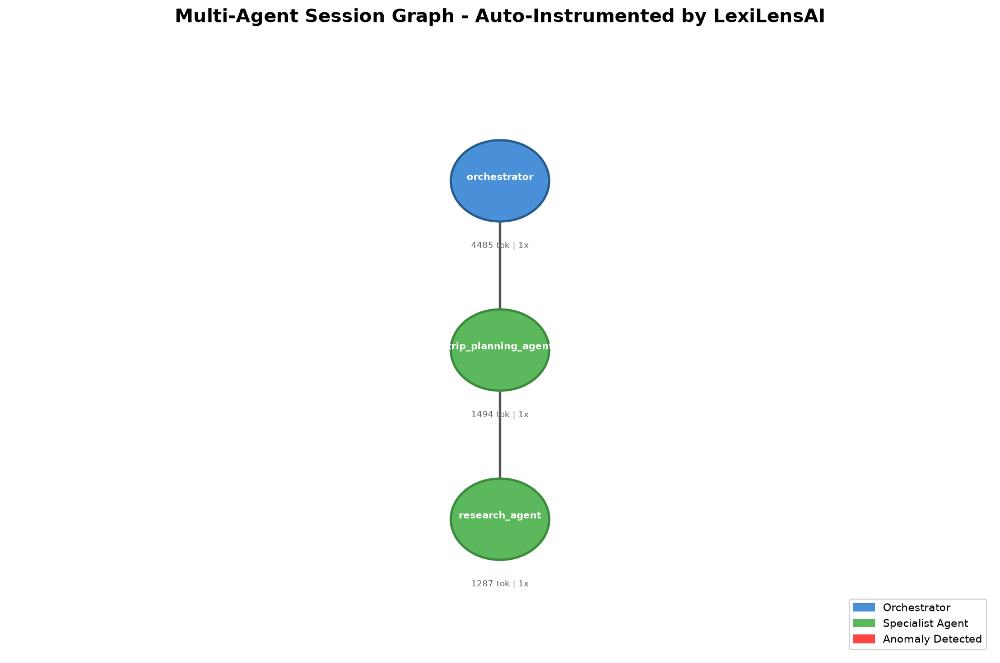

# agent-session-graph

[](https://github.com/curvsort/agent-session-graph/actions/workflows/tests.yml)

**Reconstruct AI agent execution sessions from OpenTelemetry traces.**

Most observability tools treat AI agent interactions as individual traces or spans. But multi-agent systems produce _sessions_ — long-running execution histories spanning multiple agents, tool calls, model invocations, and context transitions over extended periods.

`agent-session-graph` takes raw OpenTelemetry trace data from multi-agent workflows and reconstructs it into navigable session graphs with full execution lineage — answering not just _when_ something happened, but _why_ an outcome was produced.

---

## Featured Example

**[Multi-Agent Observability Demo](examples/strands-multi-agent-observability/)** — Session-level failures in multi-agent systems that span-level tracing misses. Includes working notebook comparing manual vs auto-instrumentation, session graph visualization, and anomaly detection.

[](examples/strands-multi-agent-observability/)

**Key insight:** Traditional tracing shows "all spans green" even when the session is failing operationally (retry storms, context drift, token explosion).

---

## The Problem

You're running multi-agent systems (Claude Agent SDK, LangChain, AutoGen, custom orchestration) on AWS Bedrock or similar infrastructure. You've instrumented with OpenTelemetry. You can see individual spans.

But you can't answer:

- **Why** did Agent B make that decision? (What context did it inherit from Agent A?)
- **When** did the session diverge from expected behavior?
- **Which** tool failure cascaded into the final bad outcome?
- **How** did token consumption compound across the delegation chain?
- **What** context was lost during compaction that led to the policy violation?

Traces tell you _what happened when_. Sessions tell you _why things turned out this way_.

---

## What This Does

```
OpenTelemetry Traces (spans, events, attributes)
        │
        ▼
┌─────────────────────────────┐
│   agent-session-graph       │
│                             │
│  • Trace normalization      │
│  • Session boundary detect  │
│  • Execution graph rebuild  │
│  • Causal lineage mapping   │
│  • Parent-child resolution  │
│  • Tool lifecycle tracking  │
│  • Cost attribution         │
└─────────────────────────────┘
        │
        ▼
Session Graph (navigable, queryable, replayable)
```

**Input:** OpenTelemetry spans from any instrumented multi-agent system  
**Output:** Structured session objects with execution lineage, delegation chains, tool interaction graphs, and cost attribution

---

## Quick Start

```bash
pip install agent-session-graph

# Or for development
git clone https://github.com/curvsort/agent-session-graph.git
cd agent-session-graph
pip install -e .

# Try the examples (work out-of-the-box with included sample data)
python examples/00_high_level_api.py
```

```python
from agent_session_graph import SessionReconstructor

# From an OTel trace export (JSON)
reconstructor = SessionReconstructor()
session = reconstructor.from_otlp_json("traces.json")

# Explore the session
print(session.execution_graph)       # Full agent delegation tree
print(session.timeline)              # Chronological event sequence
print(session.lineage("event_42"))   # Why did this event happen?
print(session.cost_attribution)      # Token/cost breakdown by agent
print(session.tool_lifecycle)        # Tool invocations and outcomes
```

### From a Running OTel Collector

```python
from agent_session_graph import SessionReconstructor, OTLPReceiver

receiver = OTLPReceiver(endpoint="localhost:4317")
reconstructor = SessionReconstructor(source=receiver)

# Reconstruct sessions as traces arrive
for session in reconstructor.stream():
    print(f"Session {session.id}: {len(session.agents)} agents, "
          f"{session.total_tokens} tokens, "
          f"{len(session.anomalies)} anomalies detected")
```

### With Claude Agent SDK / Managed Agents

```python
from agent_session_graph import SessionReconstructor

# Native session-log ingestion (higher fidelity than trace reconstruction)
reconstructor = SessionReconstructor()
session = reconstructor.from_claude_session_log("session_events.jsonl")

# Access Claude-specific signals
print(session.context_transitions)   # Context window evolution
print(session.profile_switches)      # Profile/persona changes
print(session.tool_use_patterns)     # MCP tool interaction graph
```

---

## Key Concepts

### Session vs. Trace

| Concept | Trace-Centric | Session-Centric |
|---------|--------------|-----------------|
| Primary unit | Span / Request | Session |
| Answers | When? | Why? |
| Scope | Single request lifecycle | Full operational history |
| Context | Lost between traces | Preserved across session |
| Agent relationships | Flat | Causal delegation graph |

### Execution Lineage

Traditional traces give you a timeline. `agent-session-graph` gives you lineage — the causal chain from user intent through agent delegations, tool invocations, and model interactions to the final outcome.

```
User Intent
  └─▶ Orchestrator Agent
        ├─▶ Research Agent
        │     ├─▶ Web Search Tool (success)
        │     └─▶ Knowledge Base Query (partial failure ← root cause)
        │
        ├─▶ Analysis Agent
        │     └─▶ Model Invocation (inherited bad context from Research)
        │
        └─▶ Decision Agent
              └─▶ Final Output (degraded due to upstream failure)
```

### Session Boundary Detection

Multi-agent systems don't always have explicit session markers. `agent-session-graph` uses temporal proximity, shared context attributes, delegation relationships, and trace correlation to identify session boundaries automatically.

---

## Supported Instrumentation

Works with OpenTelemetry traces from:

- **Agent frameworks:** Claude Agent SDK, LangChain, LangGraph, AutoGen, CrewAI, custom orchestration
- **Model providers:** AWS Bedrock, Anthropic API, OpenAI, self-hosted inference
- **Tool protocols:** MCP (Model Context Protocol), custom tool chains
- **Infrastructure:** Any OTel-instrumented service in the execution path

---

## Architecture

```
┌──────────────────────────────────────────────────┐
│                agent-session-graph               │
│                                                  │
│  ┌─────────────┐  ┌──────────────┐  ┌────────┐   │
│  │   Ingestion │  │  Reconstruct │  │  Query │   │
│  │             │  │              │  │        │   │
│  │ • OTLP gRPC │  │ • Boundary   │  │ • Graph│   │
│  │ • OTLP HTTP │  │ • Graph      │  │ • Time │   │
│  │ • JSON file │  │ • Lineage    │  │ • Cost │   │
│  │ • Session   │  │ • Cost       │  │ • Why  │   │
│  │   logs      │  │ • Anomaly    │  │        │   │
│  └─────────────┘  └──────────────┘  └────────┘   │
│                                                  │
└──────────────────────────────────────────────────┘
```

---

## Why This Exists

I'm building [LexiLensAI](https://www.curvsort.com/lexilensai) — a full runtime intelligence platform for enterprise AI agent operations. While building it, I realized that the foundational problem — reconstructing sessions from traces — is something every team deploying multi-agent systems struggles with independently.

This library is the session reconstruction core. The full LexiLensAI platform adds:
- Interactive runtime intelligence dashboards
- Governance policy enforcement
- Anomaly detection (recursive loops, token explosions, retry storms)
- Session replay with full state reconstruction
- Root cause analysis with explainability
- Enterprise deployment (VPC, private cloud, self-managed)

If you're running agents in production and need more than reconstruction, [reach out](mailto:rajeev.bakshi@curvsort.com).

---

## Contributing

This project is early. If you're building multi-agent systems and have opinions about session observability, I'd like to hear from you:

- Open an issue describing your agent architecture and what visibility you're missing
- PRs welcome for additional ingestion formats or framework-specific normalizers
- Star the repo if this resonates — it helps others find it

---

## License

Apache 2.0

---

## Links

- [LexiLensAI](https://www.curvsort.com/lexilensai) — Full runtime intelligence platform
- [CurvSort](https://www.curvsort.com) — Company behind this project
